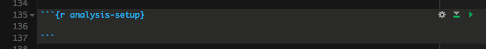

```{r setup, include=FALSE}
knitr::opts_chunk$set(echo = TRUE)
```

---

# What's literate programming


> ## **Code that is human readable!**
(ie like literature)


---

## Elements of `.Rmd`

- #### `markdown`
- #### `R` code chunks


[Quick Cheat sheet]()


---


## Three different approaches

- Code and documentation in `.Rmd`. 
    - Extract pure code to `.R` using curl
- Code in `.R`, read_chunks() and call chunks in .Rmd

- Code in `.R`, use [`roxygen2`](https://cran.r-project.org/web/packages/roxygen2/vignettes/roxygen2.html) annotation + [`spin()`] -> .html

    
---


## Not covering:

- markdown basics
- rmarkdowng basics

---

## You can achieve same results through all approaches!
### But different approaches might work different types of docs.

- Vignettes / READMEs

- Reports
    - progress reports
    - results reports

- Functions

> Dependent on the balance of text vs code vs how you prefer to work

---

## `.Rmd` (+ `knitr` -> `html`)

- Main body is the `markdown` (annotations)
- `R` in code chunks
- I use it for progress reports that do not require reproducibility or results reports to which all variables are supplied as parameters.
- I might also use it for a vignette and extract the workflow described using `knitr::purl()`


### examples

- **Dummy example: example-rmd1.Rmd** [.Rmd](https://raw.githubusercontent.com/annakrystalli/lit-prog/master/Rmd/example-rmd1.Rmd), [html](https://annakrystalli.github.io/lit-prog/Rmd/example-rmd1.html)

- **Example in action**
    - **[rmacroRDM](https://github.com/annakrystalli/rmacroRDM) vignette:** [.Rmd](https://raw.githubusercontent.com/annakrystalli/rmacroRDM/master/utils/temp_vignette.Rmd), [html](https://rawgit.com/annakrystalli/rmacroRDM/master/temp_vignette.nb.html), `purl`ed [.R](https://github.com/annakrystalli/rmacroRDM/blob/master/utils/temp_vignette.R)
---

### Using `knitr::purl` (`Rmd` -> `R`)

If your main code base is in an .Rmd or you'd like to extract the code from a vignette
you can use `purl()` *tangle* code out of a literate programming doc. 

`purl` takes many of the same arguments as `knit()` of which most important are:

- **`input`:** path to the input `.Rdm` file

- **`output`:** output file path to write to

- **`documentation`:** an integer specifying the level of documentation to go the tangled script: 
    + **0** means pure code (discard all text chunks)
    + **1** (default) means add the chunk headers to code
    + **2** means add all text chunks to code as roxygen comments

---


#### examples

```{r, eval = F}
file <- "example-rmd1"
for(docu in 0:2){
    knitr::purl(input = paste0("Rmd/", file, ".Rmd"), 
                output = paste0("R/", file, "_", docu,".R"), 
                documentation = docu)
}
```


- [**example-rmd1_0.R**](https://github.com/annakrystalli/lit-prog/blob/master/R/example-rmd1_0.R)

- [**example-rmd1_1.R**](https://github.com/annakrystalli/lit-prog/blob/master/R/example-rmd1_1.R)

- [**example-rmd1_2.R**](https://github.com/annakrystalli/lit-prog/blob/master/R/example-rmd1_2.R)

---

## Annotation in `.Rmd` + code in `.R`.

- Store and develop your code in an `.R` script
- make sure to **name chunks of code** with the convention:
```
## ---- code-chunk-name ----
r.code <- do.summat
```
- read `R` code chunks into your `.Rmd` document using `knitr::read_chunks` (need to load knitr library within the Rmd)
- run chunks by creating blank `R` chunks and naming them with appropriate chunk names in your `.Rmd`, eg.



---

## example 

- ### **`example-rmd2.Rmd`**
    - edited the markdown annotation from `example-rmd1.Rmd`
    - read the `.R` code from `example-rmd1_1.R`


## Render with rmarkdown::render()

You can render an `.Rmd` externally by calling `markdown::render`

```{r, eval=FALSE}

render(input, output_format = NULL, output_file = NULL, output_dir = NULL,
       output_options = NULL,  params = NULL)
```

e.g. I rendered this presentation into an .html document as a handout into the `handout/` directory:

```{r, eval=FALSE}
file <- "presentation"
render(input = paste0("Rmd/", file, ".Rmd"),
       html_document(theme = "journal"),
       output_file = paste0("../handout/", file, ".html"))
```


---


## `.R` + `Roxygen2` + `knirt::spin`

Good for when the code is the focus and only minimal annotation required. 
Not ideal if you want to write extensively

### principles

- input is `.R` script rather than a literate programming document
- indicate lines to be treated as `md` using `#'`
    - #' # title will be a header
    - #' some **bold** text results in some bold text
- indicate lines to be treated as code chunk options using `#+`
- use `knitr::spin` instead of `knitr::knit` (the default for .Rmd)
---

### examples

 


---

## roxygen2 function documentation

http://kbroman.org/pkg_primer/pages/docs.html

- Use roxygen2 notation to document functions
- First step to bulding your own package. 
- Makes it easy to generate required file format to support help files


[Example](https://github.com/kbroman/pkg_primer/blob/gh-pages/example/stage3/R/plot_crayons.R) by Karl Broman


---

## Roxygen2 skeleton for functions

In Rstudio, with the cursor in the body of a function, you can insert a roxygen skeleton using **code > Insert Roxygen Skeleton**


---

## Xaringer

New presentation package: Xaringer

yolo:true in YAML
